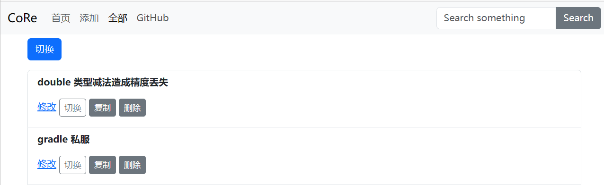

# CoRe

## 介绍

全称为`code reference`，中文名的话就叫`核`

基于SpringBoot，React 构建

可以添加代码片段，设置标题，然后通过lucene 搜索，方便代码的取用

内容支持markdown 格式（通过[Marked](https://github.com/chjj/marked) 渲染）

效果



## 使用Docker

创建镜像

```shell
$ docker build -t CoRe:1.0 .
```

启动镜像

```shell
$ docker run -it -p 9000:8080 -v "{your path}:/root/CoRe/index" app.lucenePosition=/root/CoRe/index
# 后面的参数是用来重新指定lucene 的所以文件存放位置，因为开发环境为Windows ，默认路径为`E:\测试\CoRe\index`,
#可以根据自己的需要修改
```
